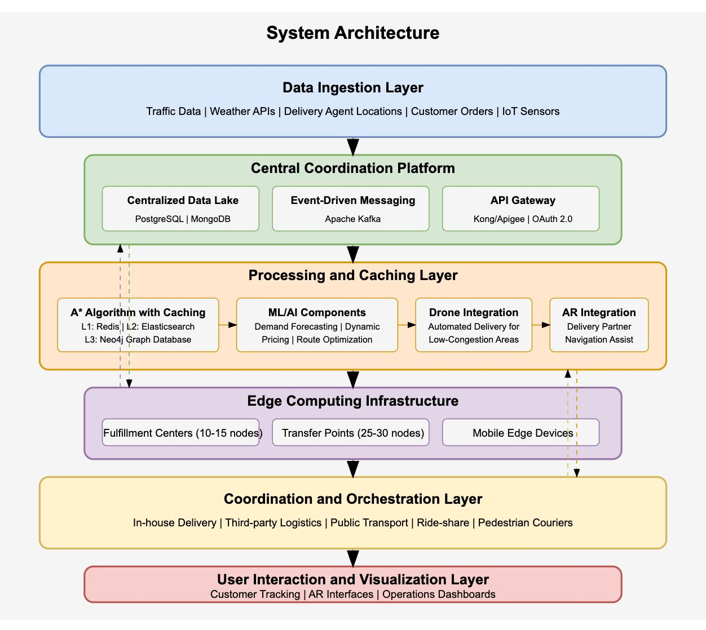
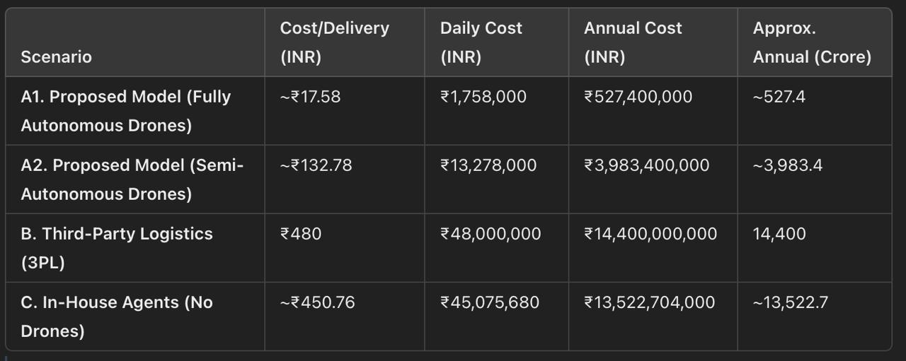

# Advanced Last-Mile Delivery System Architecture

## Problem Statement

**Case Study Question:**
"A multi-billion dollar e-commerce company wants to optimize its last-mile delivery operations in a Tier-1 city with heavy traffic congestion. The company currently relies on third-party logistics providers and in-house delivery agents. Due to increasing competition, they must cut delivery time by 30% while reducing logistics costs by 20% without compromising customer satisfaction. Develop an end-to-end strategy using Al-driven route optimization, real-time demand forecasting, and dynamic pricing for delivery slots. Provide a quantitative model for implementation, considering real-world constraints like erratic traffic patterns, delivery agent availability, and variable demand. Justify the feasibility of your model with supporting calculations and assumptions."

I have written my approach below:-

<!-- more -->

## 1. System Architecture

- **Overview:**

The proposed architecture is a modular, distributed system that integrates various subsystems to handle route optimization, demand forecasting, dynamic pricing, and real-time operations. Key layers include:



### Data Ingestion Layer


 Gathers real-time data from multiple sources such as traffic feeds, weather APIs, delivery agent locations, public transit schedules, and customer orders.
    
### Central Coordination Platform
    
The central coordination platform forms the heart of the system. It is a cloud-based microservices platform built on major providers like AWS or Azure. The platform leverages containerized services orchestrated by Kubernetes to ensure modularity and scalability.
    
**Key Elements:**

- **Centralized Data Lake:**
    - **Function:** Stores historical delivery data, traffic patterns, and customer preferences.
    - **Technologies:**
        - **Relational Database (PostgreSQL):** Manages transactional and structured data.
        - **NoSQL Database (MongoDB):** Handles unstructured data, enabling flexible schema design.
- **Event-Driven Messaging System:**
    - **Function:** Processes real-time data streams from delivery vehicles, transfer points, and external traffic sources.
    - **Technology:**
        - **Apache Kafka:** Capable of handling roughly 500 events per second under normal conditions, scaling up to 2,000 events per second during peak periods.
- **API Gateway:**
    - **Function:** Provides a secure communication channel between internal microservices and external integrations.
    - **Technologies:**
        - **Kong or Apigee:** Implements OAuth 2.0 and API key-based authentication for robust security
### Processing and Caching Layer
    
Utilizes a caching mechanism to store frequently accessed routing and demand data. This layer leverages the Star algorithm with caching techniques to quickly compute optimal delivery routes. Drones and AR (augmented reality) interfaces are also integrated here to support last-mile delivery visualization and partner assistance.

**Multi-Level Caching Structure:**

- **L1 Cache (Redis):**
    - **Role:** Stores frequently requested routes.
    - **Performance:** Achieves sub-millisecond access times; target is to maintain about 50,000 pre-computed routes with a hit rate of around 75%.
- **L2 Cache (Elasticsearch):**
    - **Role:** Contains detailed route segments and historical performance metrics.
    - **Performance:** Designed to store around 500,000 route segments with access times under 50ms.
- **L3 Cache (Neo4j Graph Database):**
    - **Role:** Maintains the complete road network topology enriched with traffic metadata.
    - **Scale:** Holds approximately 2 million nodes and 5 million edges representing the urban transportation network.

*Enhancements to the A Algorithm:**

- **Dynamic Weighting Factors:**
    
    Adjust route cost calculations based on real-time traffic, weather, and time-of-day factors.
    
- **Hierarchical Route Planning:**
    
    Initially computes major artery routes and then refines to last-mile details.
    
- **Contraction Hierarchies:**
    
    Drastically reduces computation time by simplifying the network graph, with improvements up to 85% compared to standard A*.
    
- **Custom Heuristic Functions:**
    
    Machine learning calibrates these heuristics based on historical data to improve accuracy in real-world scenarios.
    
    
### Demand Forecasting
    
- **Objective:** Predict fluctuations in order volumes based on historical and real-time data.
- **Key Inputs:** Historical sales data, seasonality patterns, special events (holidays, local festivals), and weather forecasts.
- **Usage:**
    1. **Resource Allocation:** Decide how many drones, delivery agents, or vehicles to deploy in a given region.
    2. **Inventory Positioning:** Position goods optimally across micro-fulfillment centers to reduce delivery times.
    3. **Proactive Scaling:** Scale up cloud and edge computing resources in anticipation of demand spikes.

**Technical Details**

1. **Data Pipeline:**
    - **ETL Process:** Data from order management systems and external APIs (weather, event calendars) is ingested into a central data lake.
    - **Feature Engineering:** Transform raw data into model-friendly features (e.g., day-of-week, holiday indicators, temperature, local event density).
2. **Model Selection:**
    - **Time Series Models:** ARIMA, SARIMA, or Prophet (Facebook/Meta’s library) for univariate or simple multivariate forecasting.
    - **Machine Learning Models:** Random Forest, Gradient Boosting (XGBoost), or Neural Networks (LSTM, GRU) for more complex, multi-variate forecasting.
3. **Hyperparameter Tuning and Validation:**
    - **Cross-Validation:** Split historical data into training and validation sets, ensuring time-order integrity.
    - **Metrics:** Mean Absolute Error (MAE), Root Mean Squared Error (RMSE), or Mean Absolute Percentage Error (MAPE).

**Sample Code**

```python title="Demand Forecasting"
    
    data = pd.read_csv('historical_orders.csv', parse_dates=['date'])
    data['day_of_week'] = data['date'].dt.dayofweek
    data['is_holiday'] = data['date'].apply(lambda x: 1 if x in holiday_list else 0)
    data['orders_lag_1'] = data['orders'].shift(1)  
    data.dropna(inplace=True)
    
    features = ['day_of_week', 'is_holiday', 'orders_lag_1']
    X = data[features]
    y = data['orders']
    tscv = TimeSeriesSplit(n_splits=3)
    rf = RandomForestRegressor(n_estimators=50, random_state=42)
    param_grid = {'n_estimators': [50, 100], 'max_depth': [5, 10, None]}
    
    grid_search = GridSearchCV(rf, param_grid, cv=tscv, scoring='neg_mean_absolute_error')
    grid_search.fit(X, y)
    best_model = grid_search.best_estimator_
    print("Best Params:", grid_search.best_params_)
    future_data = pd.read_csv('future_dates.csv')
    future_predictions = best_model.predict(future_data[features])
    print("Predicted Orders:", future_predictions)
    
    
```
    
    
    
### Dynamic Pricing
    
- **Objective:** Adjust delivery fees or time-slot pricing in real time based on **demand, traffic, and resource availability**.
- **Key Inputs:** Current order volume, historical pricing data, capacity constraints (e.g., number of available drones/agents), traffic congestion levels.
- **Usage:**
    1. **Peak Management:** Increase prices during high-demand periods to control order influx.
    2. **Off-Peak Incentives:** Lower prices in slow periods to encourage usage.
    3. **Revenue Optimization:** Maximize profitability by balancing supply (delivery resources) and demand (customer orders).

**Technical Details**

1. **Pricing Model:**
    - **Heuristic Approach:** Simple supply-demand ratio. For instance, if demand is 120% of capacity, increase price by a certain factor.
    - **Machine Learning / Reinforcement Learning:** A Q-learning or bandit-based approach to optimize pricing strategies in different market conditions.
2. **Constraints & Safety Checks:**
    - **Customer Satisfaction:** Set upper and lower bounds to avoid extreme price swings.
    - **Regulatory Compliance:** Ensure the model adheres to consumer protection laws and avoids price gouging.
3. **Integration with Other Systems:**
    - **Demand Forecasting:** Anticipate upcoming surges or lulls.
    - **Route Optimization:** Factor in real-time route constraints and resource usage.
    
**Sample Code**

```python title="Dynamic Pricing Heuristic"

def dynamic_pricing(current_demand, max_capacity, base_price=50, surge_multiplier=1.5):
    demand_ratio = current_demand / max_capacity

    
    if demand_ratio > 1.2:
        return base_price * surge_multiplier
    elif demand_ratio < 0.8:
        
        return base_price * 0.9
    else:
        
        return base_price
current_demand = 120 
max_capacity = 100
new_price = dynamic_pricing(current_demand, max_capacity, base_price=50)
print("New Delivery Price:", new_price)

```
    
---
    
### Route Optimization
    
- **Objective:** Integrate with the **A*** algorithm by providing **predictive weights** (e.g., estimated traffic congestion, resource availability, road closures).
- **Key Inputs:** Real-time traffic feeds, fuel/energy costs, driver/drone availability, road network topology.
- **Usage:**
    1. **Dynamic Rerouting:** Adjust delivery paths in response to sudden congestion or weather changes.
    2. **Multi-Modal Coordination:** Combine drones, public transit, ride-share, and pedestrian couriers under a single routing framework.
    3. **Time and Cost Efficiency:** Ensure that routes minimize both travel time and operational costs.

**Technical Details**

1. **A* Algorithm Enhancements:**
    - **Heuristic Function:** Typically Euclidean or Manhattan distance. Enhanced with ML-based traffic predictions to give a better estimate of actual travel times.
    - **Weight Updates:** Continuously update edge weights in the graph based on real-time data (e.g., a busy road segment might have a higher cost).
2. **Graph Representation:**
    - **Nodes:** Intersections, transfer points, delivery addresses.
    - **Edges:** Roads or air paths for drones. Each edge has a dynamic cost that can include traffic levels, drone flight restrictions, or tolls.
3. **Caching Layer Integration:**
    - **Redis (L1):** Quickly retrieves recently computed routes.
    - **Elasticsearch (L2):** Stores route segments and performance metrics for analytics.
    - **Neo4j (L3):** Maintains the entire graph with traffic metadata, enabling deeper queries or re-computation of sub-routes.

**Sample Code**

```python title="A* with ML-Powered Edge Weights"

def traffic_prediction(edge_attributes):
    
    base_time = edge_attributes['base_time']
    congestion_factor = edge_attributes['congestion_factor']  # from ML model
    return base_time * congestion_factor

def heuristic(u, v, graph):
    (x1, y1) = graph.nodes[u]['coords']
    (x2, y2) = graph.nodes[v]['coords']
    return np.sqrt((x2 - x1)**2 + (y2 - y1)**2)

def a_star_ml(graph, start, goal):
    for (u, v) in graph.edges():
        graph[u][v]['weight'] = traffic_prediction(graph[u][v])

    path = nx.astar_path(graph, start, goal, heuristic=lambda x, y: heuristic(x, y, graph), weight='weight')
    return path
G = nx.DiGraph()
optimal_path = a_star_ml(G, start='Warehouse_1', goal='Customer_123')
print("Optimized Path:", optimal_path)

```    
- Overall Benefits of ML/AI Modules
1. **Proactive Adaptation:**
    - The system can forecast spikes in demand, automatically increase prices or deploy more resources, and recalculate routes to avoid congestion.
2. **Efficiency and Scalability:**
    - Demand forecasting ensures that resources are allocated where they are needed most, reducing idle time and operational costs.
    - Dynamic pricing helps balance supply and demand, preventing system overload.
3. **Continuous Learning:**
    - The models improve over time as they ingest more data about traffic, customer behavior, and environmental conditions, making the system increasingly accurate and cost-effective.
4. **Synergy with Other Components:**
    - By feeding route optimization outputs into the caching layer, the system can deliver near-instant route computations for common paths.
    - Demand forecasting results inform dynamic pricing modules to keep the entire logistics network in equilibrium.

---

### AR Integration
    
**Purpose:**

Augmented Reality (AR) assists delivery partners by overlaying navigation guidance, package details, and drop-off instructions on their device screens, improving efficiency and accuracy.

**Implementation:**

- **AR-Based Navigation:** Uses computer vision and GPS data to guide delivery agents through congested or complex urban environments.
- **Visual Markers & Object Recognition:** Scans buildings or addresses to verify correct drop-off points.
- **Real-Time Information Overlay:** Displays package details, security codes, and customer instructions through smart glasses or mobile devices.

**Benefit:**

AR enhances last-mile delivery by reducing errors, improving delivery speed, and making navigation seamless, especially in high-density areas.

### Edge Computing Infrastructure
    
To minimize latency in decision-making, edge computing nodes are strategically deployed to perform time-critical computations closer to the data source.

**Deployment Locations and Roles:**

- **Primary Fulfillment Centers:**
    - **Nodes:** 10-15 dedicated GPU servers.
    - **Function:** Execute intensive route optimization computations.
- **Major Transfer Points:**
    - **Nodes:** 25-30 industrial-grade servers with 5G connectivity.
    - **Function:** Support rapid data exchange and localized decision-making.
- **Mobile Edge Devices:**
    - **Devices:** Ruggedized tablets and smartphones in delivery vehicles.
    - **Function:** Run edge-optimized versions of the routing and AR applications.

**Synchronization:**

- Data updates occur every 5 minutes for traffic conditions and every 30 minutes for broader network changes, ensuring that edge nodes maintain current information.

### Data Pipeline Architecture
    
The data pipeline is designed to handle both real-time and batch processing efficiently, ensuring that the system’s various components are continuously supplied with accurate and timely information.

**Components:**

- **Apache NiFi:**
    - **Function:** Ingests data from IoT devices, mobile applications, and third-party systems.
- **Apache Spark:**
    - **Function:** Performs stream processing and real-time analytics with a latency target of under 2 seconds.
- **Airflow:**
    - **Function:** Orchestrates batch processing workflows, particularly for nightly recalibration of routing algorithms.
- **Lambda Architecture:**
    - **Function:** Integrates batch and real-time processing streams to provide a unified view of the data.

### Security Architecture
    
A robust security framework is embedded at every layer of the architecture to protect data integrity and ensure compliance.

**Security Measures:**

- **Zero Trust Architecture:**
    - **Function:** Enforces authentication for every service regardless of network location.
- **End-to-End Encryption:**
    - **Standards:** TLS 1.3 for data in transit and AES-256 for data at rest.
- **Real-time Threat Monitoring:**
    - **Integration:** SIEM solutions for continuous security event monitoring and automated threat responses.
- **Role-Based Access Control (RBAC):**
    - **Function:** Provides granular access permissions managed via a centralized identity provider.

### Coordination and Orchestration Layer
    
Acts as the central hub for decision-making, coordinating between in-house delivery agents, third-party logistics, public transportation systems, ride-share partners, and pedestrian couriers. This layer integrates business rules and safety protocols.
    
### User Interaction and Visualization Layer
    
Provides AR-based interfaces for delivery partners, real-time tracking for customers, and dashboards for operations managers.
    

## **2. Cost Analysis**

### Key Assumptions

1. **Drone Purchase & Maintenance**
    - **Drone Unit Cost:** $2,000 → ₹160,000
    - **Maintenance & Battery Replacement:** $500/year → ₹40,000/year per drone
    - **Drone Lifespan:** ~3 years (≈900 operational days)
    - **Total 3-Year Cost per Drone:** ₹160,000 + (3 × ₹40,000) = ₹280,000
2. **Labor Rates & Overheads**
    - **In-House average Hourly Wage(Tech):** $15/hour → ₹1,200/hour
    - **Overhead (20%):** Additional ₹240/hour
    - **Effective Wage:** ₹1,440/hour (including overhead)
3. **Third-Party Logistics (3PL) Rate**
    - Typically $5–$7/package in congested areas → **₹400–₹560/package**
    - For this comparison, we use **₹480/package** as a midpoint (equivalent to $6).
4. **Vehicle/Fuel Costs (In-House Couriers)**
    - $0.50/mile → ₹40/mile
    - Average 50 miles/day → 50 × ₹40 = **₹2,000/day** per courier
5. **Computational Resources (AI/ML, Route Optimization, Caching)**
    - **Cloud CPU:** $0.30/hour per core → ₹24/hour per core
    - **GPU Acceleration:** $1/hour → ₹80/hour
    - **Edge Node:** $5,000 (one-time) → ₹400,000 + ₹8,000/month operational cost
6. **Operator Oversight for Drones (Semi-Autonomous)**
    - 1 operator can supervise 5 drones
    - Operator wage: $15/hour → ₹1,200/hour + 20% overhead = ₹1,440/hour
    - 8-hour shift → ₹1,440 × 8 = **₹11,520/day** per operator
7. **Deliveries per Drone/Courier**
    - **Drone:** 20 deliveries/day each
    - **In-House Courier:** 30 deliveries/day each

---

### Scenario A: Proposed Advanced Model (Drones + AI/ML + Edge + AR)

#### A1. Drone Hardware Depreciation (Fully Autonomous)

1. **Drone Cost (3 years total)**
    - **Purchase + Maintenance:** ₹280,000 per drone for 3 years (~900 days).
    - **Daily Depreciation per Drone:** ₹280,000 ÷ 900 ≈ **₹311.11/day**
2. **Number of Drones Needed**
    - 100,000 deliveries/day ÷ 20 deliveries/drone/day = **5,000 drones**
3. **Daily Drone Fleet Depreciation**
    - 5,000 drones × ₹311.11 = **₹1,555,555/day** (~₹1.56 million/day)
4. **Cost per Delivery (Fully Autonomous)**
    - ₹1,555,555 ÷ 100,000 = **₹15.56/delivery**

#### A2. Drone Hardware + Operator Oversight (Semi-Autonomous)

If regulations require a human operator to monitor multiple drones:

1. **Operators Needed**
    - 1 operator per 5 drones
    - 5,000 drones → 1,000 operators
2. **Operator Daily Wage**
    - ₹11,520/day per operator
    - 1,000 operators → ₹11,520 × 1,000 = **₹11,520,000/day** (₹11.52 million/day)
3. **Total Drone + Operator Cost (Daily)**
    - Drone Depreciation: ₹1,555,555
    - Operator Oversight: ₹11,520,000
    - **Total: ₹13,075,555/day**
4. **Cost per Delivery (Semi-Autonomous)**
    - ₹13,075,555 ÷ 100,000 = **₹130.76/delivery**

---

#### A3. Computational Overhead (AI/ML + Edge)

1. **AI/ML Computations**
    - Per-route cost: $0.02 → **₹1.6**
    - 100,000 deliveries + ~10% re-routes = 110,000 computations/day
    - 110,000 × ₹1.6 = **₹176,000/day**
2. **Cloud CPU & GPU**
    - **32 CPU cores** at ₹24/hour each → 32 × ₹24 = ₹768/hour → ₹768 × 24 = **₹18,432/day**
    - **GPU** usage (8 hours/day) at ₹80/hour → 8 × ₹80 = **₹640/day**
    - **Total Cloud** = ₹18,432 + ₹640 = **₹19,072/day**
3. **Edge Node Costs**
    - 10 nodes × ₹400,000 = ₹4,000,000 (one-time)
    - Amortize over 900 days → ~₹4,444/day
    - Monthly ops: 10 × ₹8,000 = ₹80,000 → ~₹2,667/day
    - **Total Edge** = ₹4,444 + ₹2,667 = **~₹7,111/day**
4. **Total Daily Computational Overhead**
    - AI/ML: ₹176,000
    - Cloud CPU/GPU: ₹19,072
    - Edge Infra: ₹7,111
    - **Sum: ₹202,183/day**
5. **Cost per Delivery (Computational)**
    - ₹202,183 ÷ 100,000 = **₹2.02/delivery**

---

#### A4. Total Cost per Delivery (Proposed Model)

- **Fully Autonomous:**
    - Drone Depreciation: **₹15.56**
    - Computational Overhead: **₹2.02**
    - **Total:** ~**₹17.58** per delivery
- **Semi-Autonomous:**
    - Drone + Operator: **₹130.76**
    - Computational Overhead: **₹2.02**
    - **Total:** ~**₹132.78** per delivery

### Annual Costs    

- **Fully Autonomous:**
    - ₹17.58 × 100,000/day = ₹1,758,000/day → ~₹527,400,000/year (₹527.4 crore/year)
- **Semi-Autonomous:**
    - ₹132.78 × 100,000/day = ₹13,278,000/day → ~₹3,983,400,000/year (₹3,983.4 crore/year)

---

### Scenario B: Third-Party Logistics (3PL)

#### B1. Per-Package Rate

- Typical last-mile in congested areas: **₹400–₹560/package**
- We use **₹480/package** (≈ $6) for calculation.

#### B2. Cost per Delivery

- **₹480** per package (all-inclusive).

#### B3. Daily & Annual Costs

- **Daily:** 100,000 × ₹480 = **₹48,000,000/day** (₹48 million/day)
- **Annual (300 days):** 48 million × 300 = **₹14,400,000,000** (₹1,440 crore/year)

---

### Scenario C: Traditional In-House Delivery Agents (No Drones)

#### C1. Labor & Vehicle Costs per Courier

1. **Daily Wage + Overhead**
    - Hourly wage: $15 → ₹1,200 + 20% overhead → ₹1,440/hour
    - 8-hour shift → 8 × ₹1,440 = **₹11,520/day**
2. **Vehicle/Fuel**
    - 50 miles/day × ₹40/mile = **₹2,000/day**
3. **Total per Courier**
    - ₹11,520 + ₹2,000 = **₹13,520/day**

#### C2. Couriers Needed for 100,000 Deliveries/Day

- **30 deliveries/day** per courier
- 100,000 ÷ 30 = ~3,334 couriers

#### C3. Total Daily Cost (In-House, No Drones)

- 3,334 couriers × ₹13,520 = **~₹45,075,680/day** (₹45.08 million/day)

#### C4. Cost per Delivery

- ₹45.08 million ÷ 100,000 = **₹450.76/delivery**

#### C5. Annual Cost

- 300 days × ₹45.08 million = **₹13,524 million** (₹1,352.4 crore/year)

### **Final Analysis**



## **3. Risk Analysis**

- **Regulatory & Legal**
    - **Specific Risk:** Drone regulations & airspace restrictions
    - **Risk Level:** Low
    - **Mitigation Strategies:** Engage with regulators early; conduct pilot testing and obtain necessary permits; implement robust geo-fencing and dynamic flight-path planning.
- **Technological & Operational**
    - **Specific Risk:** Drone reliability and safety (hardware failures, weather, etc.)
    - **Risk Level:** High
    - **Mitigation Strategies:** Schedule regular maintenance and perform real-time diagnostics; maintain a reserve fleet for quick replacement; integrate weather monitoring systems.
- **Technological & Operational**
    - **Specific Risk:** AI/ML and edge computing system failures
    - **Risk Level:** Medium
    - **Mitigation Strategies:** Deploy redundant edge nodes and cloud backups; use distributed tracing and continuous monitoring; perform regular stress tests and performance audits.
- **Financial & Capital**
    - **Specific Risk:** High upfront CAPEX and scalability risks
    - **Risk Level:** High
    - **Mitigation Strategies:** Implement phased rollouts and pilot programs; perform detailed cost-benefit analysis; explore leasing or financing options for the drone fleet and edge infrastructure.
- **Workforce & Social**
    - **Specific Risk:** Labor displacement and public acceptance issues
    - **Risk Level:** Medium
    - **Mitigation Strategies:** Integrate existing couriers into hybrid roles; provide training for new technology; engage in transparent public communication and community outreach.
- **Cybersecurity & Data Privacy**
    - **Specific Risk:** Cyberattacks and data breaches
    - **Risk Level:** High
    - **Mitigation Strategies:** Implement a Zero Trust security model with end-to-end encryption; use SIEM for continuous threat monitoring; conduct regular penetration testing and vulnerability scans.
- **Scalability & Integration**
    - **Specific Risk:** Integration challenges with legacy systems and external partners
    - **Risk Level:** Medium
    - **Mitigation Strategies:** Develop a robust API gateway and middleware solutions; use incremental integration and extensive testing; standardize data formats and protocols.
- **Business Continuity**
    - **Specific Risk:** System outages and disruptions due to natural disasters or cyber incidents
    - **Risk Level:** High
    - **Mitigation Strategies:** Establish active-active configurations across regions; develop a comprehensive disaster recovery plan with regular drills; implement fallback mechanisms and backups.

## 4.Implementation Timeline and Milestones

we will follow these Phases based system :

### Phase 1: Planning and Design (Months 1–3)

- **Requirements & Feasibility Study:**
    - Gather detailed requirements across all layers: data ingestion, coordination, processing, and user interaction.
    - Perform feasibility studies, risk assessments, and cost-benefit analyses.
- **Stakeholder Engagement:**
    - Engage with regulators, potential partners (public transit, 3PL, technology vendors), and internal teams.
    - Secure initial approvals and permits for drone operations.
- **Architecture & System Design:**
    - Finalize high-level system architecture including data pipelines, API ecosystem, multi-level caching, and edge computing placement.
    - Define the initial AI/ML model parameters for route optimization and dynamic pricing.
- **Milestones:**
    - Detailed project plan and requirements document approved.
    - Regulatory roadmap established and initial permits submitted.
    - High-level architecture design documented.

---

### Phase 2: Development and Integration (Months 4–9)

- **Core System Development:**
    - Develop the Central Coordination Platform using cloud microservices (AWS/Azure) and container orchestration (Kubernetes).
    - Build the Data Ingestion and Data Pipeline components (using Apache NiFi, Spark, Airflow, etc.).
- **Processing and Caching Module:**
    - Implement the enhanced A* algorithm with multi-level caching (Redis, Elasticsearch, Neo4j).
    - Integrate initial AI/ML models for route optimization and dynamic pricing.
- **Edge Computing and AR Interface Development:**
    - Deploy edge computing nodes at pilot locations (fulfillment centers and transfer points).
    - Develop AR interfaces for delivery partners and integration with drones.
- **API & Integration Development:**
    - Create the API gateway for secure communication between components and external partners.
    - Begin integration with third-party systems (traffic, weather, and public transit data).
- **Milestones:**
    - Prototype of the coordination platform with core data pipelines operational.
    - Working version of the processing and caching layer with initial AI/ML integration.
    - Edge computing nodes deployed and AR interface prototype demonstrated.

---

### Phase 3: Pilot Testing and Optimization (Months 10–15)

- **Pilot Deployment:**
    - Launch a pilot in a selected high-density urban area with controlled volume (e.g., 10-20% of target volume).
    - Deploy a limited drone fleet (both fully autonomous if allowed, or semi-autonomous with operator oversight) along with human fallback options.
- **Monitoring & Feedback:**
    - Establish performance monitoring frameworks (real-time dashboards, distributed tracing, SIEM for security).
    - Collect detailed feedback on route optimization, delivery times, cost per delivery, and user experience.
- **Optimization:**
    - Fine-tune AI/ML models and caching parameters based on real-world data.
    - Adjust operational parameters (e.g., drone scheduling, operator oversight ratio) as necessary.
- **Milestones:**
    - Successful pilot run with defined KPIs met (e.g., 30% reduction in delivery times, cost per delivery improvements).
    - Comprehensive pilot evaluation report with recommendations for full-scale deployment.
    - Updated system architecture and risk mitigation strategies based on pilot outcomes.

---

### Phase 4: Full-Scale Deployment (Months 16–24)

- **System-Wide Rollout:**
    - Gradually expand the system across the entire Tier-1 city.
    - Scale up drone fleet, edge computing nodes, and integration points as per pilot learnings.
- **Operational Integration:**
    - Transition from pilot to production: integrate with existing in-house operations, 3PL partnerships, and additional multi-modal delivery options (public transit, ride-share, pedestrian couriers).
- **Training & Support:**
    - Conduct comprehensive training for operational teams and drone operators (if required).
    - Establish ongoing support and maintenance procedures.
- **Performance Monitoring & Continuous Improvement:**
    - Implement robust performance monitoring and feedback loops for continuous optimization.
    - Schedule regular updates and system upgrades based on operational data and evolving regulatory requirements.
- **Milestones:**
    - City-wide deployment achieving target volume (e.g., 100,000 daily deliveries).
    - Documented improvements in delivery time reduction and cost savings (30% and 20% targets).
    - Ongoing operational and support framework in place with regular performance reviews.

---

### Final Phase: Post-Deployment and Scaling (Month 25 onward)

- **Expansion & Scaling:**
    - Evaluate potential expansion into new regions or additional cities.
    - Consider integrating further innovative delivery options (e.g., enhanced AR features, additional drone capabilities).
- **Continuous Risk Management:**
    - Update risk assessments and mitigation plans regularly based on real-world performance and new challenges.
    - Keep improving regulatory compliance and operational efficiency.
- **Milestones:**
    - Successful expansion into new regions with consistent performance metrics.
    - Regular system updates and risk mitigation reviews documented and implemented.

## 5. Conclusion

The proposed  distributed system for optimizing last-mile delivery operations represents a significant advancement in urban logistics technology. This comprehensive architecture integrates cutting-edge technologies including drone delivery, AI/ML algorithms, multi-level caching, and edge computing to address the challenges of efficient package delivery in congested urban environments.

After thorough analysis of the system architecture, cost implications, risk assessment, and implementation timeline, the following key conclusions emerge:

- **Substantial Cost Efficiency**: The fully autonomous drone-based delivery model demonstrates remarkable economic advantages, with per-delivery costs of approximately ₹17.58 compared to ₹480 for third-party logistics and ₹450.76 for traditional in-house delivery methods. This translates to potential annual savings of nearly ₹13,000 crore when compared to conventional approaches.
- **Technical Feasibility with Layered Architecture**: The proposed system's multi-layered architecture—spanning from data ingestion through central coordination, processing and caching, edge computing, coordination, and user interaction—creates a robust and scalable framework capable of handling 100,000 daily deliveries with real-time adaptability.
- **Manageable Risk Profile**: While the system faces several high-risk challenges, particularly in drone reliability, cybersecurity, and business continuity, the comprehensive mitigation strategies outlined in the risk analysis provide viable approaches to address these concerns through redundancy, continuous monitoring, and phased implementation.
- **Practical Implementation Pathway**: The 24-month phased implementation plan provides a structured approach to system deployment, starting with planning and design, progressing through development and integration, followed by pilot testing, and culminating in full-scale deployment with established milestones at each stage.
- **Transformative Potential**  Beyond cost savings, the system offers significant improvements in delivery speed, operational efficiency, and environmental impact by optimizing routes, balancing demand fluctuations, and leveraging multi-modal delivery options including innovative drone technology.

